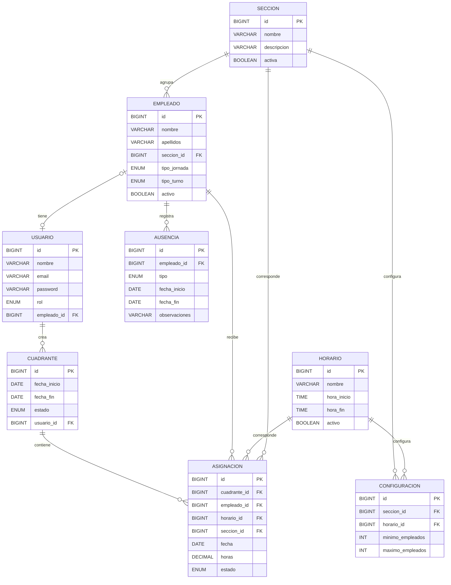

# Diagrama entidad-relación de GestionaTurnos

El siguiente diagrama representa las ocho entidades principales de la base de datos, sus claves primarias (PK), claves foráneas (FK) y relaciones.

```mermaid
erDiagram
    USUARIO {
        BIGINT id PK
        VARCHAR nombre
        VARCHAR email
        VARCHAR password
        ENUM rol
        BIGINT empleado_id FK
    }

    EMPLEADO {
        BIGINT id PK
        VARCHAR nombre
        VARCHAR apellidos
        BIGINT seccion_id FK
        ENUM tipo_jornada
        ENUM tipo_turno
        BOOLEAN activo
    }

    SECCION {
        BIGINT id PK
        VARCHAR nombre
        VARCHAR descripcion
        BOOLEAN activa
    }

    HORARIO {
        BIGINT id PK
        VARCHAR nombre
        TIME hora_inicio
        TIME hora_fin
        BOOLEAN activo
    }

    CONFIGURACION {
        BIGINT id PK
        BIGINT seccion_id FK
        BIGINT horario_id FK
        INT minimo_empleados
        INT maximo_empleados
    }

    AUSENCIA {
        BIGINT id PK
        BIGINT empleado_id FK
        ENUM tipo
        DATE fecha_inicio
        DATE fecha_fin
        VARCHAR observaciones
    }

    CUADRANTE {
        BIGINT id PK
        DATE fecha_inicio
        DATE fecha_fin
        ENUM estado
        BIGINT usuario_id FK
    }

    ASIGNACION {
        BIGINT id PK
        BIGINT cuadrante_id FK
        BIGINT empleado_id FK
        BIGINT horario_id FK
        BIGINT seccion_id FK
        DATE fecha
        DECIMAL horas
        ENUM estado
    }

    EMPLEADO |o--o| USUARIO : tiene
    SECCION ||--o{ EMPLEADO : agrupa
    SECCION ||--o{ CONFIGURACION : configura
    HORARIO ||--o{ CONFIGURACION : configura
    EMPLEADO ||--o{ AUSENCIA : registra
    USUARIO ||--o{ CUADRANTE : crea
    CUADRANTE ||--o{ ASIGNACION : contiene
    EMPLEADO ||--o{ ASIGNACION : recibe
    HORARIO ||--o{ ASIGNACION : corresponde
    SECCION ||--o{ ASIGNACION : corresponde
```
